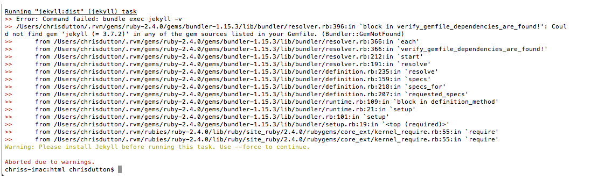

# Common Errors - Node / Grunt / Build 

## All current FE builds

	jekyll -v = 3.4.3
	node -v = 6.11.4
	npm -v = 3.10.10
	ruby -v = ruby 2.7.2p137 (2020-10-01 revision 5445e04352) [x86_64-darwin19]

---

## Jekyll Issues

If you get the following



Do `jekyll -v`

 If Jekyll does not run when you run `jekyll -v` then delete the GemLock file and run grunt again and it should be fine!

### Common Problems

1. `jekyll -v`
2. if error then try`bundle exec grunt`
3. or try `gem install bundler`
4. Try copying over `package-json.lock`


### NPM Issues

Fixing npm issues on Mac, other option is: https://gist.github.com/DanHerbert/9520689

### Useful guides to help with Issues
Good guide if having loads of issues http://misheska.com/blog/2013/06/16/using-rvm-to-manage-multiple-versions-of-ruby/

Best Guide to get up and running: https://www.moncefbelyamani.com/how-to-install-xcode-homebrew-git-rvm-ruby-on-mac/

Good guide if having loads of issues http://misheska.com/blog/2013/06/16/using-rvm-to-manage-multiple-versions-of-ruby/

If getting openssl errors with, like 
Reason: image not found - /Users/dutts/.rvm/src/ruby-2.4.1/.ext/x86_64-darwin17/openssl.bundle
https://stackoverflow.com/questions/20092600/error-loading-rubygems-plugin-openssl-bundle-loaderror

---

## Node Issues

All KMP websites now use Node `6.11.4` and npm `3.10.10`.

To switch node version, simply run `n` and select the one needed.

* Home Decor - 8.9.4 node
* Staff Status - 6.11.4
* GLA  - 6.11.4
* Aeroparker  - 8.9.4 node, but changed to 6.11.4

Latest Node: https://nodejs.org/en/ - use the downloader so both the npm and node are installed


---

## Browser Sync Errors

If the build is failing on the browsersync then it will be using the wrong version.

* Go into package.json and make sure to change to this `"grunt-browser-sync": "1.9.2"`.
* Change the dependencies and devDependencies.
* Then, delete **node_modules** folder
* Run `npm install` again.
* Then finish off with `npm shrinkwrap`
* Make new ticket on project
* Push up files for BE

---

## Assemble issues with build

If when trying to build a website built in assemble and you get
>> Warning: Unexpected token ... Used --force, continuing.

Then you need to do the following.

* Delete the `node_modules` folder
* Change the `grunt-assemble` in the package.json file to this `"grunt-assemble": "^0.6.3"`,

### Modernizr on Builds

>>Running "modernizr:dist" (modernizr) task
Warning: Unexpected token ... Used --force, continuing.

This is because the Node version is most likely `6.11.4` and this has issues with this version. You can either change the node to `8.9.4` or add a force on and off before each modernizr call in the default.hbs file.

```
grunt.registerTask('forceOn', 'turns the --force option ON',
	function() {
		if (!grunt.option('force')) {
			grunt.config.set('forceStatus', true);
			grunt.option('force', true);
		}
});

grunt.registerTask('forceOff', 'turns the --force option Off',
	function() {
		if (grunt.config.get('forceStatus')) {
			grunt.option('force', false);
		}
});

grunt.registerTask('default', ['forceOn', 'modernizr', 'forceOff']);
```

You can do it so it does not use force like above, but this means changing the package.json file. Change the modernizr version and add in customizr

```
"grunt-modernizr": "1.0.2"
},
"devDependencies": {
    "customizr": "1.1.0"
  }
```

---

## package.json
* dependencies - uses in the final project, jquery, react, angular etc
* devDependencies - used just for the build, not for the live site - eslint, watch etc
---

## Shrinkwrap

This is used so anyone else using the project can use the correct package versions. All projects should have this file setup.

* Delete `package-lock.json`
* `npm shrinkwrap -dev` will get all of the `devDependencies` in package.json
* `npm shrinkwrap`. This will use all of the `dependencies` in package.json. 
* Delete `node_modules` folder
* `npm install`

If running a new build and never installed `node_modules` or `grunt` before then you have to do it a little different. As `npm-shrinkwrap` and `npm-shrinkwrap -dev` create an empty `npm-shrinkwrap.json` file if not done correctly, so you need to do this:

* Delete `package-lock.json`if it is there.
* Delete `node_modules` folder
* Delete existing `npm-shrinkwrap.json`
* Run `npm install` - so it runs (this is for me only)
* Run `npm shrinkwrap -dev` will get all of the `devDependencies` in package.json
* Run`npm shrinkwrap`. This will use all of the `dependencies` in package.json. 
* Make sure it is in that order
* `npm install` 
* This should all work. 
* To test the shrinkwrap works, delete `node_modules` and run `npm install`
* Then run `grunt` to check it works
* Push up files so everyone can use my setup.

---

# Grunt Issues

## ES6 Minification
ES6 JS does not work with the uglify plugin. If you get errors then just run this:

```npm install grunt-contrib-uglify-es --save-dev```

* Issues with mac at home, try just `npm install` to see if that works. * Try updating OS to new one if that fails.
* Issues with new build with error on npm install.
* Downgrade the image min to:  "grunt-contrib-imagemin": "0.9.1",
* Delete node_modules and do grunt again

--- 

## Sass Compile Error
Loading "sass.js" tasks...ERROR
>> Error: Node Sass does not yet support your current environment: OS X 64-bit with Unsupported runtime (59)
>> For more information on which environments are supported please see:
>> https://github.com/sass/node-sass/releases/tag/v3.13.1
Warning: Task "sass" not found. Use --force to continue.

Running this fixes it: `npm rebuild node-sass`

---

## Assemble Issues
>> Warning: Missing helper: "is" Use --force to continue.
Change the version of assemble to `"grunt-assemble": "0.4.0"`,

---

## Mojave Install Issues

Install XCODE 10. - https://stackoverflow.com/questions/10335747/how-to-download-xcode-dmg-or-xip-file

`xcode-select -print-path` -should be the same as below, if not, do:

`sudo xcode-select -s /Applications/Xcode.app/Contents/Developer`

`run brew doctor`

---

## Internet Issues with Mojave.

* Finder > Go >Go to Folder - /Library/Preferences/SystemConfiguration/
Delete:
*  com.apple.airport.preferences.plist
*  com.apple.network.eapolclient.configuration
*  com.apple.wifi.message-tracer.plist
*  NetworkInterfaces.plist
*  preferences.plist

---

## Common Checks
* node -v
* npm -v
* brew doctor
* brew -config
* brew update

---

## Install Home-brew - https://brew.sh/
1. `/usr/bin/ruby -e "$(curl -fsSL https://raw.githubusercontent.com/Homebrew/install/master/install)"`
2. `brew doctor`
